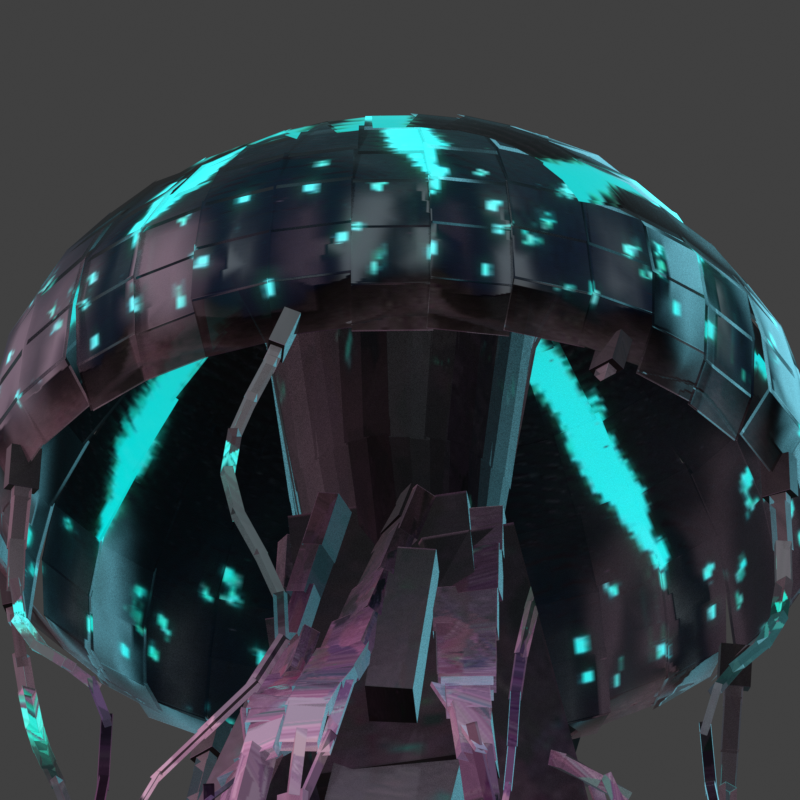

# Pinene Jellyfish Boss

Minecraft Bedrock向けの空中型ボスクラゲ単体パックです。
旧3Dモデルを基準に、暗い半透明の傘、赤紫の内部組織、
シアンの発光模様と、独立して揺れる16本の触手を再構成しています。




プレビューは書き出したBedrock JSONと実際のテクスチャから描画したものです。
Minecraft内のスクリーンショットではなく、照明・PBR表現は近似です。

## 現在の状態

- v0.1.6 / v21 中央の膜と触手の束の境目をなじませた開発版
- 下端を中央組織へ埋め込み、8方向の浅いひだから上へ広がる膜で、傘の内面の周囲32か所へ接続
- 結合部の形と専用UV領域だけを調整し、旧GLBの中央組織の色を連続して投影
- 外側は傘の縁、中央は内部組織へ接続し、浮いた黒いパーツを付け根へ再配置
- 近距離622 cuboids / 3,656 triangles（従来1,136 / 9,176）
- 80ブロック超では206 cuboids / 1,224 trianglesの遠距離モデル
- 傘幅約12ブロック / 触手込み高さ約18ブロック
- 114 bones / 113 animated bones（遠距離は傘のみ1 boneをアニメーション）
- 16 independent tentacle chains
- 外側8関節・内側6関節、6秒の波を根元から先端へ伝える
- 中央の曲面は近距離96枚 / 384 triangles、遠距離32枚 / 128 trianglesの薄い2面パネル
- shell・tissueの2描画層、1層のみ半透明
- 512x512 color・normal・MERSを2組使用
- 元のApril GLBから色・模様を直接投影して焼き込み
- 水色の発光はMERSへ統合し、119個の独立発光パーツを廃止
- 回転変換、UVマッピング、隠れた面を修正
- 巨大サイズはモデル・骨に焼き込み、物理倍率は1.0
- 飛行・索敵・近接攻撃・ボスバーの仮実装
- v16は実機動画で形・動作を確認し、ユーザー体感で軽さが改善
- v17は実機動画で形と動きを確認し、ユーザー評価は「かなりいい感じ」
- v18は481姿勢と16本すべての付け根を検査し、下面のプレビューを確認
- v18の実機動画で中央組織と傘の間の隙間を確認
- v19の実機画像を受けて、段状の結合部を上に広がる曲面へ修正
- v21は96区間と32か所すべての内面接続を検証し、481姿勢を確認
- v20の実機画像で細い首と色の境界が目立つことを確認し、v21で下端の形と色の投影を修正
- v21の実機の接続表示・FPS・透過・LOD切替は再確認待ち
- 形の確認後にアニメーションと挙動の整理へ移る予定
- v21はv20と同じ描画面数・関節数・描画層数・テクスチャ寸法。FPSの数値は実機未測定

## 導入と確認

1. `py -3 scripts/package_mcaddon.py` を実行します。
2. `dist/pinene-jellyfish-boss-v0.1.6.mcaddon` をMinecraftで開きます。
3. ワールドへBPとRPを適用します。
4. クリエイティブのアイテム欄から「ボスクラゲのスポーンエッグ」を使うか、次のコマンドで召喚します。

```mcfunction
/give @s pinene:jellyfish_boss_spawn_egg
/summon pinene:jellyfish_boss
```

Vibrant VisualsのPBRを使うため、Minecraft Bedrock 1.21.120以上を対象にしています。
通常描画でも元のカラーと透過は残りますが、MERS発光・湿ったPBR表現は
対応グラフィックモードで確認してください。

## 開発

```powershell
py -3 scripts/validate_pack.py
py -3 scripts/package_mcaddon.py
```

`docs/bosses/jellyfish/generated/` は各世代の出力記録、
`resource_pack/` と `behavior_pack/` は実機投入対象です。
生成処理は `tools/jellyfish_boss/` にあります。

再生成手順と比較条件は [v21-build.md](docs/bosses/jellyfish/v21-build.md) を参照してください。