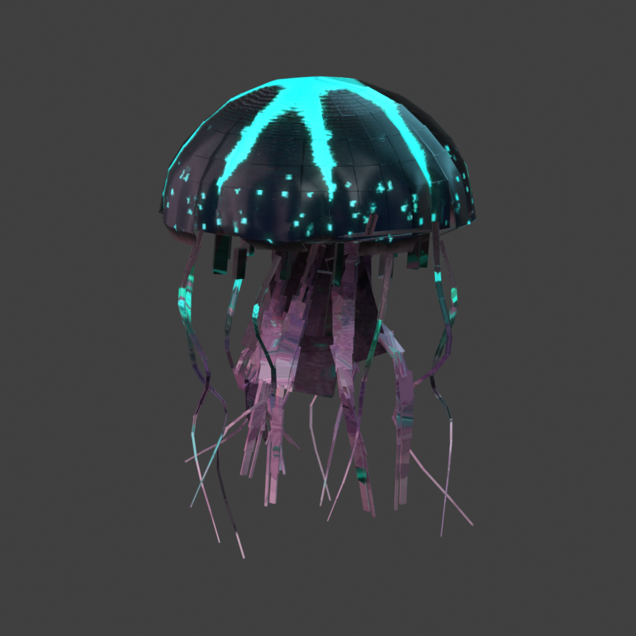
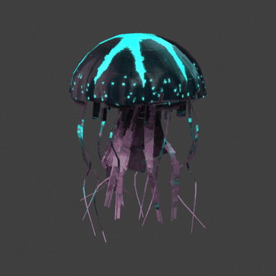

# Pinene Jellyfish Boss

Minecraft Bedrock向けの空中型ボスクラゲ単体パックです。
旧3Dモデルを基準に、暗い半透明の傘、赤紫の内部組織、
シアンの発光模様と、独立して揺れる16本の触手を再構成しています。





プレビューは書き出したBedrock JSONと実際のテクスチャから描画したものです。
Minecraft内のスクリーンショットではなく、照明・PBR表現は近似です。

## 現在の状態

- v0.1.2 / v17 触手のしなやかさを調整した開発版
- 近距離526 cuboids / 3,272 triangles（従来1,136 / 9,176）
- 80ブロック超では174 cuboids / 1,096 trianglesの遠距離モデル
- 傘幅約12ブロック / 触手込み高さ約18ブロック
- 114 bones / 113 animated bones（遠距離は傘のみ1 boneをアニメーション）
- 16 independent tentacle chains
- 外側8関節・内側6関節、6秒の波を根元から先端へ伝える
- 直線的な枝を連続した細いリボンへ整理し、描画面数はv16と同じ
- shell・tissueの2描画層、1層のみ半透明
- 512x512 color・normal・MERSを2組使用
- 元のApril GLBから色・模様を直接投影して焼き込み
- 水色の発光はMERSへ統合し、119個の独立発光パーツを廃止
- 回転変換、UVマッピング、隠れた面を修正
- 巨大サイズはモデル・骨に焼き込み、物理倍率は1.0
- 飛行・索敵・近接攻撃・ボスバーの仮実装
- v16は実機動画で形・動作を確認し、ユーザー体感で軽さが改善
- v17は481姿勢の接続検査と書き出しデータの動くプレビューを確認
- v17の実機FPS・透過・LOD切替は再確認待ち
- 面数は同じでも関節の計算量は増えるため、FPSが同じとは断定しません

## 導入と確認

1. `py -3 scripts/package_mcaddon.py` を実行します。
2. `dist/pinene-jellyfish-boss-v0.1.2.mcaddon` をMinecraftで開きます。
3. ワールドへBPとRPを適用します。
4. クリエイティブのアイテム欄から「ボスクラゲのスポーンエッグ」を使うか、次のコマンドで召喚します。

```mcfunction
/give @s pinene:jellyfish_boss_spawn_egg
/summon pinene:jellyfish_boss
```

Vibrant VisualsのPBRを使うため、Minecraft Bedrock 1.21.120以上を対象にしています。
通常描画でも元のカラーと透過は残りますが、MERS発光・湿ったPBR表現は
対応グラフィックモードで確認してください。

## 開発

```powershell
py -3 scripts/validate_pack.py
py -3 scripts/package_mcaddon.py
```

`docs/bosses/jellyfish/generated/` は各世代の出力記録、
`resource_pack/` と `behavior_pack/` は実機投入対象です。
生成処理は `tools/jellyfish_boss/` にあります。

再生成手順と比較条件は [v17-build.md](docs/bosses/jellyfish/v17-build.md) を参照してください。
