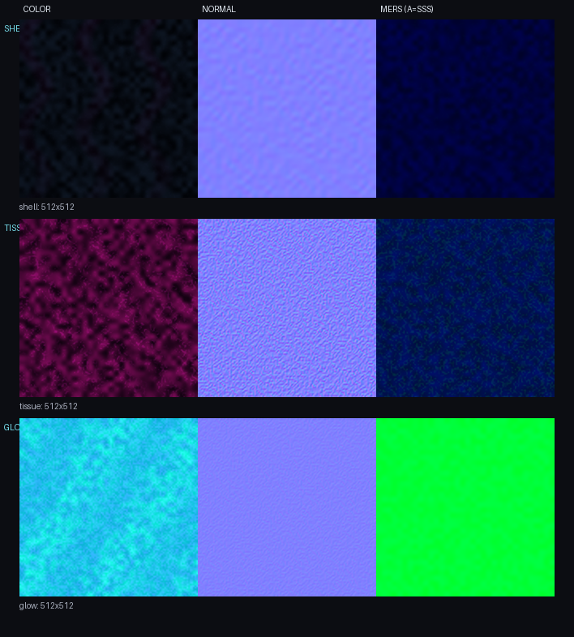

# Pinene Jellyfish Boss

Minecraft Bedrock向けの空中型ボスクラゲ単体パックです。
旧3Dモデルを基準に、暗い半透明の傘、赤紫の内部組織、
シアンの発光模様と、独立して揺れる16本の触手を再構成しています。



## 現在の状態

- v0.1.0 開発版
- 1,136 cuboids / 実描画9,176 triangles
- 58 bones / 57 animated bones
- 16 independent tentacle chains
- shell・tissue・glowの3描画層
- 各512x512 color・normal・MERSテクスチャ
- 飛行・索敵・近接攻撃・ボスバーの仮実装
- 戦闘バランスと実機表示は未調整

## 導入と確認

1. `py -3 scripts/package_mcaddon.py` を実行します。
2. `dist/pinene-jellyfish-boss-v0.1.0.mcaddon` をMinecraftで開きます。
3. ワールドへBPとRPを適用します。
4. 次のコマンドで召喚します。

```mcfunction
/summon pinene:jellyfish_boss
```

Vibrant VisualsのPBRを使うため、Minecraft Bedrock 1.21.120以上を対象にしています。
通常描画でもカラー・透過・発光レイヤーは残ります。

## 開発

```powershell
py -3 scripts/validate_pack.py
py -3 scripts/package_mcaddon.py
```

`docs/bosses/jellyfish/generated/` は各世代の出力記録、
`resource_pack/` と `behavior_pack/` は実機投入対象です。
生成処理は `tools/jellyfish_boss/` にあります。